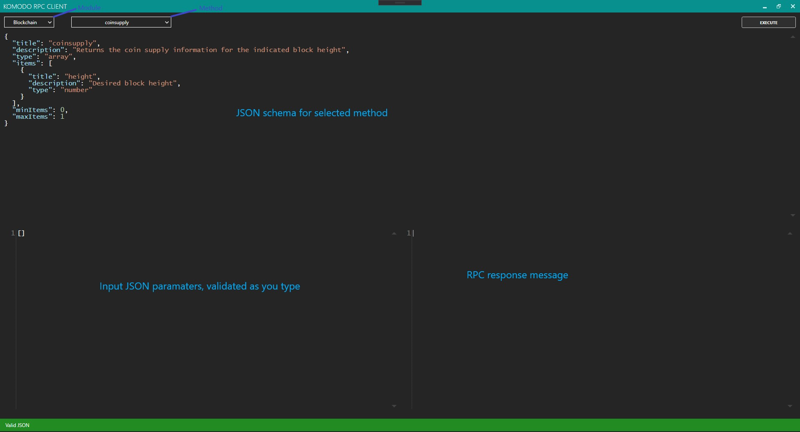

# Komodo RPC Client

An RPC Client for the [Komodo](https://komodoplatform.com/) platform with easy support for adding RPC methods in the future by simply modifying a JSON file. Additionally, it validates the user JSON input to prevent faulty requests from being made.


## Getting Started

[KomodoRpcClient.Api](KomodoRpcClient.Api) defines all the known RPC methods as read from a JSON file. If the file doesn't already exist, a default one is created for you. Modules and Methods can easily be added to this file in the future.
Use the `KomodoApiFile` class to load a JSON file.

```csharp
var apiFile = new KomodoApiFile ( "KomodoApi.json" );
apiFile.Load ( ); // Gets the default API if file doesn't exist
apiFile.Save ( ); // Save the current API
var api = apiFile.Api;
```

`KomodoApi` has a `Dictionary<string, Module>` and each `Module` has a `List<Method>` in it. Users are expected to use `Method.GetJsonSchema()` to known how to form the parameters for an RPC call.


[KomodoRpcClient.Rpc](KomodoRpcClient.Rpc) contains all of the RPC related functionality required for making RPC requests.
`RpcSettings` is a serializable class that can be used to create an `RpcClient(RpcSettings settings)` object.
Here's the recommended way to use this class:

```csharp
var rpc = new RpcClient ( settings );
var result = await rpc.CallAsync ( "methodName", "JSON serialized params array" );
if ( result.HasError )
{
	Exception error = result.Error;
	// Do something about it!
}
string response = result.Response;
```


[KomodoRpcClient.GUI](KomodoRpcClient.GUI) is a WPF application that wraps all of this into an easy to use UI.



On first run, a sample `RpcSettings.json` file is created for you. None of the methods will execute until this file is filled out correctly.
